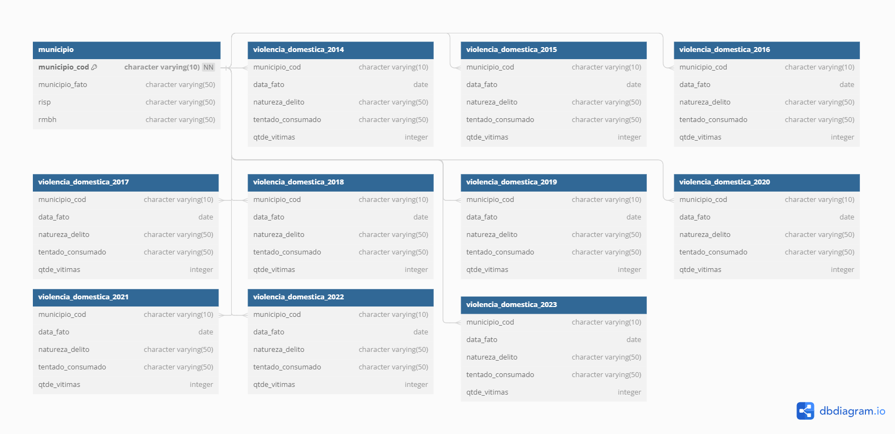

# Trabalho Prático 2

Universidade Federal de Minas Gerais\
Instituto de Ciências Exatas\
Departamento de Ciência da Computação\
Disciplina Introdução a Bancos de Dados (IBD)\
1º Semestre de 2024

Autor: João Paulo Gonçalves da Silva

## Introdução

Este trabalho visa analisar os registros sobre Violência Doméstica e familiar contra a Mulher no estado de Minas Gerais durante os anos de 2014 e 2023. Foram produzidas 11 tabelas de dados, sendo 10 referentes aos casos por ano e outra criada para conter os dados dos municípios. O esquema UML resultante se encontra no [modelo online](https://dbdiagram.io/d/Violencia-Domestica-6678ce5e5a764b3c72357289).

Para manipular os dados, foram importados os arquivos csv referentes à violência doméstica contra a mulher do portal [dados.gov.br](https://dados.gov.br/dados/conjuntos-dados/violencia-contra-mulher). Depois, utilizou-se o gerenciador Postgresql, além do Microsoft SQL Server, para análise e tratamento dos dados.
Link para o repositório do projeto no github: https://github.com/jpzajo/TP_2_IBD_2024_1

## Análise crítica e integrada

Problemas e soluções encontrados ao longo do projeto:
- Todas as tabelas anuais também incluíam o nome do município, a Região Integrada de Segurança Pública (RISP) e se o município se encontrava ou não na Região Metropolitana de Belo Horizonte (RMBH). Todas essas informações foram exportadas para uma nova tabela chamada Município, referenciada pelo código do município nas outras tabelas (chave estrangeira).
- Um caractere vazio devido à exportação das tabelas a partir do formato csv foi removido. O caractere causava inconsistências no número de municípios por tabela por se encontrar antes do primeiro atributo de "munucipio_cod" em cada tabela.
- Na tabela referente a 2023, a partir de um certo ponto, todos os valores de "data_fato" se encontravam como o número de dias contados desde 1/1/1900; enquanto todas as outras datas possuíam o formato "YYYY-MM-DD HH-MM-SS", com os valores de hora, mês e dia zerados. Por meio do Microsoft SQL Server, foi possível converter diretamente o número para uma data no formato "YYYY-MM-DD", bem como as demais datas na tabela. Dessa forma, todos os valores de "data_fato" estão padronizados através de todas as tabelas, com tipo date e formato "YYYY-MM-DD".
- As tabelas originais possuíam colunas específicas para o mês e o ano de cada caso. Como ambos podem ser facilmente calculados a partir da coluna "data_fato", as duas colunas foram removidas.
- O município Serra da Saudade (código 316660) não se encontra na tabela referente a 2022. Ao se observar o baixo volume de casos nos outros anos da tabela, é possível que não tenha ocorrido nenhuma notificação neste ano. Assim, todas as tabelas menos esta possuem 853 municípios, conforme o esperado.
- Os dados da tabela referente a 2023 vão apenas até 02/08, resultando em um número consideravelmente menor de casos em relação às outras tabelas. Assim, este outlier foi desconsiderado na análise referente ao total de casos.

## Análise exploratória

