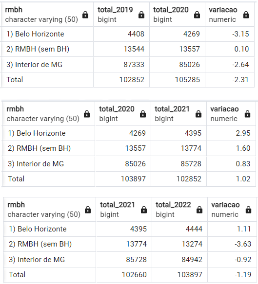

# Trabalho Prático 2

Universidade Federal de Minas Gerais\
Instituto de Ciências Exatas\
Departamento de Ciência da Computação\
Disciplina Introdução a Bancos de Dados (IBD)\
1º Semestre de 2024

Autor: João Paulo Gonçalves da Silva

## Introdução

Este trabalho visa analisar os registros sobre Violência Doméstica e familiar contra a Mulher no estado de Minas Gerais durante os anos de 2014 e 2023. Foram produzidas 11 tabelas de dados, sendo 10 referentes aos casos por ano e outra criada para conter os dados dos municípios. O esquema UML resultante se encontra no [modelo online](https://dbdiagram.io/d/Violencia-Domestica-6678ce5e5a764b3c72357289).

Para manipular os dados, foram importados os arquivos csv referentes à violência doméstica contra a mulher do portal [dados.gov.br](https://dados.gov.br/dados/conjuntos-dados/violencia-contra-mulher). Depois, utilizou-se o gerenciador Postgresql, além do Microsoft SQL Server, para análise e tratamento dos dados.
Link para o repositório do projeto no github: https://github.com/jpzajo/TP_2_IBD_2024_1

## Análise crítica e integrada

Problemas e soluções encontrados ao longo do projeto:
- Inicialmente, a ideia era utilizar os dados da Secretaria de Estado de Saúde (SES) de Minas Gerais. Porém, devido ao alto volume de valores nulos, optou-se por utilizar este set de dados, que naturalmente não possuía nenhum valor nulo.
- Todas as tabelas anuais também incluíam o nome do município, a Região Integrada de Segurança Pública (RISP) e se o município se encontrava ou não na Região Metropolitana de Belo Horizonte (RMBH). Todas essas informações foram exportadas para uma nova tabela chamada Município, referenciada pelo código do município nas outras tabelas (chave estrangeira).
- A partir de 2020, os valores da coluna "risp" das tabelas anuais trocavam a palavra "RISP" por "Departamento". Para efeitos de consistência entre tabelas, agora todas se referem a "RISP".
- Como os dados foram extraídos do Armazém SIDS/REDS, cujas informações foram baseadas na natureza dada ao registro no momento de sua lavratura, possíveis alterações nas tipificações dos delitos, realizadas no momento de aceite no PCnet, não podem ser captadas pelo banco de dados. Assim, os dados dependem inerentemente do preenchimento correto do Registro de Eventos de Defesa Social (REDS). Além disso, por se tratar de um Sistema integrado, os dados tratados contemplam as ocorrências elaboradas pelo Corpo de Bombeiros Militar, Departamento de Edificações e Estradas de Rodagem, Polícia Civil, Policia Militar, Polícia Rodoviária Federal, Sistema Prisional e Sistema Socioeducativo. 
- Um caractere vazio devido à exportação das tabelas a partir do formato csv foi removido. O caractere causava inconsistências no número de municípios por tabela por se encontrar antes do primeiro atributo de "munucipio_cod" em cada tabela.
- Na tabela referente a 2023, a partir de um certo ponto, todos os valores de "data_fato" se encontravam como o número de dias contados desde 1/1/1900; enquanto todas as outras datas possuíam o formato "YYYY-MM-DD HH-MM-SS", com os valores de hora, mês e dia zerados. Por meio do Microsoft SQL Server, foi possível converter diretamente o número para uma data no formato "YYYY-MM-DD", bem como as demais datas na tabela. Dessa forma, todos os valores de "data_fato" estão padronizados através de todas as tabelas, com tipo date e formato "YYYY-MM-DD".
- As tabelas originais possuíam colunas específicas para o mês e o ano de cada caso. Como ambos podem ser facilmente calculados a partir da coluna "data_fato", as duas colunas foram removidas.
- O município Serra da Saudade (código 316660) não se encontra na tabela referente a 2022. Ao se observar o baixo volume de casos nos outros anos da tabela, é possível que não tenha ocorrido nenhuma notificação neste ano. Assim, todas as tabelas menos esta possuem 853 municípios, conforme o esperado.

## Análise exploratória

O objetivo da analíse é estudar a hipótese de que houve aumento considerável na violência doméstica em Minas Gerais durante a Pandemia do COVID-19. Para isso, obteve-se o total de casos por ano e calculou-se a variação no número de registros de um ano para outro. Assim, nota-se que houve diminuição de 2,31% no número de registros entre 2019 e 2020, aumento de 1,02% entre 2020 e 2021, e diminuição de 1,09% entre 2021 e 2022. 

No período considerado, as Regiões Integradas de Segurança Pública (RISPs) com menor e maior número de registros foram Unaí e Ipatinga, respectivamente.

O número se manteve relativamente estável ao longo de todos os anos analisados, com mínimo de 102.183 em 2016 e máximo de 105.285 em 2019.\
Os dados da tabela referente a 2023 vão apenas até 02/08, resultando em um número consideravelmente menor de casos em relação às outras tabelas. Assim, este outlier deve ser desconsiderado na análise referente ao total de casos.

# Conclusões

Pelos dados observados, entende-se que o número de Registros de Eventos de Defesa Social (REDSs) não aumentou nem diminuiu consideravelmente com a pandemia no período observado. Como as estimativas chegam a [um aumento de 50%] (https://www.sejus.df.gov.br/wp-conteudo/uploads/2021/01/violencia-domestica-em-tempos-de-pandemia.pdf) no número de denúncias no Brasil inteiro, entende-se que ou Minas Gerais não foi tão afetada pela pandemia nesse aspecto, ou os casos que ocorreram não foram denunciados propriamente.
